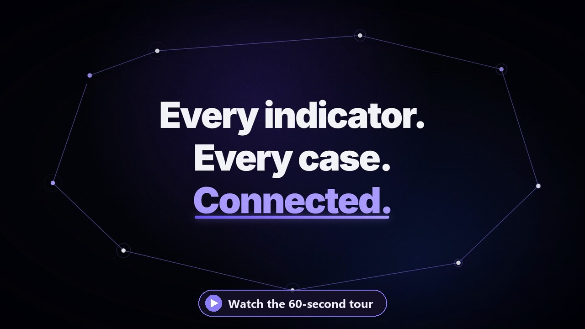

<p align="center">
  
</p>

# Black Ticket

A SOC ticket, case and IOC correlation platform. Analysts record the incidents
they work as cases; every observable entered (IP, hash, domain, e-mail…) is
deduplicated globally, and the moment the same indicator shows up on another case
the two cases are linked automatically.

Design goal: **the useful core of TheHive, without the installation and usage
overhead.**

<p align="center">
  <a href=".github/assets/blackticket-promo.mp4">
    
  </a>
</p>

- Detailed technical plan: [PLAN.md](PLAN.md)
- Interface design structure: [packages/web/DESIGN.md](packages/web/DESIGN.md)

## Requirements

| Component | Version |
|---|---|
| Node.js | 22+ |
| PostgreSQL | 16+ |

## Getting started

```bash
npm install
cp .env.example .env      # fill in the values
npm run db:migrate
npm run db:seed
npm run dev
```

| Service | Address |
|---|---|
| Web UI | http://localhost:5173 |
| API | http://localhost:3000/api/v1 |
| API docs (Swagger) | http://localhost:3000/api/docs |
| Health check | http://localhost:3000/api/v1/health |

## First sign-in

`npm run db:seed` creates an administrator account (the `SEED_ADMIN_*` values in
`.env`). The password is temporary: it must be changed at first sign-in, and no
other endpoint can be used until it is.

Then enter and lock the organisation's e-mail domain on the **Organisation domain**
screen. Every account created after the lock — CSV imports included — must be in
that domain.

## End-to-end tests

```bash
cd packages/api && npx tsx scripts/phase55-e2e.ts
```

The `phase2`–`phase5` scripts sign in as the administrator. The administrator
password is never written in the code; pass it as an environment variable on each
run. If two-factor authentication is on for the administrator account, pass the
seed as well:

```bash
BT_ADMIN_PASS=<password> BT_TOTP_ADMIN=<base32-seed> npx tsx scripts/phase5-e2e.ts
```

`BT_ADMIN_USER` selects a different administrator account (default `admin`).

The `phase55` script only uses the SOC lead and analyst accounts, so it runs in
any case.

## Load testing

Requires k6 (`winget install GrafanaLabs.k6`). The dataset is generated into a
separate database; the working database is never touched.

```bash
createdb blackticket_loadtest
cd packages/api && DATABASE_URL="postgresql://.../blackticket_loadtest" npx prisma migrate deploy
psql -d blackticket_loadtest -f scripts/load/seed.sql
```

Then point the API at that database and run the test:

```bash
DATABASE_URL="postgresql://.../blackticket_loadtest" API_PORT=3200 RATE_LIMIT_GLOBAL_PER_MIN=1000000 node dist/main.js
cd scripts/load && k6 run -e BASE=http://127.0.0.1:3200/api/v1 -e PASS=loadtest-harbor-quartz-97 -e PEAK=40 browse.js
```

Write the target as `127.0.0.1`, not `localhost`: on Windows `localhost` tries
`::1` first, and since the API only listens on IPv4 that adds ~200 ms to every new
connection. The rate limit has to be raised too — all the load comes from one
address, so the default limit would measure the limiter rather than the
application. Afterwards, `dropdb blackticket_loadtest`.

## Deployment (Docker)

Installing on a server, updating and backups: **[docker/README.md](docker/README.md)**

## User guides

| For | Document |
|---|---|
| Anyone working cases | [Analyst guide](docs/analyst-guide.md) |
| First-line (L1) analysts, step by step with screenshots | [L1 Analyst Runbook (PDF)](docs/L1-Analyst-Runbook.pdf) |
| Users of the `Administration` section | [Administrator guide](docs/admin-guide.md) |
| Security review | [ASVS L2 assessment](docs/security-assessment.md) |

## Backup and restore

> **A database dump on its own is not a restorable backup.** TOTP seeds, the OIDC
> client secret and the mail password are stored **encrypted** in the database;
> the key is `TOTP_ENCRYPTION_KEY` in `.env`, and it is not in the dump. A restore
> without the key gives a system where everyone's two-factor is broken, SSO cannot
> authenticate and mail cannot send. Keep the key **separate** from the dumps.

```powershell
# Back up (dump + a manifest of what it needs; prunes anything older than 30 days)
./packages/api/scripts/backup/backup.ps1 -OutDir D:/backups/blackticket -KeepDays 30

# Restore — into a NEW database by default
./packages/api/scripts/backup/restore.ps1 `
  -Dump D:/backups/blackticket/blackticket-20260827-123159.dump `
  -Target blackticket_restore_test
```

`restore.ps1` refuses to overwrite the live database without `-Force`, and even
with `-Force` it stops if clients are connected. If the code is newer than the
dump, run `npx prisma migrate deploy` after restoring; the manifest next to each
dump lists the migrations it contains.

**Rehearse it, don't just document it.** The procedure was tested end to end on
2026-08-27: a backup was taken and restored into a separate database, the row
counts matched exactly (31 users, 189 cases, 1444 audit entries), the API was
started against that database, and the encrypted TOTP seeds were confirmed to
decrypt with the right key and be rejected with a wrong one.

## Maintenance

The scripts in `scripts/maintenance/` do the jobs that do not fit in a migration
and must run without locking.

**Audit log archiving** — the trail is append-only and the application cannot
prune it; a delete coming from the application silently does nothing. Pruning is a
separate operation run with a role that owns the table:

```powershell
# Dry run: writes the archive, deletes nothing from the trail
./packages/api/scripts/maintenance/audit-archive.ps1 -OlderThanDays 730 -ArchiveDir D:/archives
# Actually delete
./packages/api/scripts/maintenance/audit-archive.ps1 -OlderThanDays 730 -ArchiveDir D:/archives -Confirm
```

It exports to JSONL, verifies the row count, switches the rule off, deletes and
switches it back on inside a single transaction, then writes what it did into the
trail itself. `-Database` lets you rehearse on a restored copy. **Archive files are
evidence**; keep them with the dumps, under the same access control.

**Indicator search index** — on an installation where the observable table holds
millions of rows, run this **before** `prisma migrate deploy`:

```bash
psql -d blackticket -f packages/api/scripts/maintenance/observable-trgm-index.sql
```

It builds the index without stopping write traffic. The migration that adds the
same index uses `IF NOT EXISTS`, so afterwards it does nothing. On fresh or small
installations this step is unnecessary; the migration handles it instantly.

## Package layout

| Package | Contents |
|---|---|
| `@black-ticket/shared` | Enums, DTO types, the RBAC permission matrix — shared by client and server |
| `@black-ticket/api` | NestJS API server, Prisma schema, background jobs |
| `@black-ticket/web` | React + Vite interface |

Outside the packages, `design/brand/` holds the brand sources: the master render
of the logo animation and the ffmpeg script that produces the browser assets from
it. Details: [design/brand/README.md](design/brand/README.md).

## Phase status

- [x] Phase 0 — Skeleton
- [x] Phase 1 — Identity and access (login, 2FA, RBAC, audit, domain policy)
- [x] Phase 2 — Case core (cases, tasks, work log, timeline, MITRE, SLA)
- [x] Phase 3 — Observables and correlation (normalisation, automatic linking, whitelist, IOC search)
- [x] Phase 4 — Alert ingest and SLA (API keys, ingest, queue, SLA sweep, notifications)
- [x] Phase 5 — CMS / admin console (user lifecycle, CSV import, audit viewer, settings)
- [x] Phase 5.5 — UI/UX (tag picker, automatic task playbooks, top bar, editable dashboard)
- [x] Phase 6 — Enterprise identity (SSO with OIDC, JIT provisioning, role mapping, SCIM 2.0, break-glass)
- [x] Phase 7 — Outbound e-mail (SMTP + Microsoft Graph, queue and delivery log)
- [x] Phase 8 — Hardening and rollout
  - [x] Load testing (800 users / k6)
  - [x] Backup and restore (rehearsed)
  - [x] User guides
  - [x] Security review ([ASVS L2](docs/security-assessment.md))
  - [x] Deployment ([docker/README.md](docker/README.md))
  - [x] Data retention policy and archiving

## Contributing

Bug reports and contributions are welcome: [CONTRIBUTING.md](CONTRIBUTING.md).
Every pull request requires agreement to the [Contributor License Agreement](CLA.md).
Report security vulnerabilities to the maintainer directly, not in a public issue.

## Licence

Black Ticket is licensed under the [GNU Affero General Public License v3.0](LICENSE)
(AGPL-3.0).

You may install, use and modify it in your organisation free of charge. If you
distribute a modified version to others, or offer it as a service over a network,
you must publish that version's source code under the same licence.

**Commercial licence and support.** If the AGPL terms do not fit your use — for
example, you want to include Black Ticket in a closed-source product — a separate
commercial licence is available. Installation, support and customisation services
are offered as well. Reach the maintainer through the links on their GitHub
profile.
